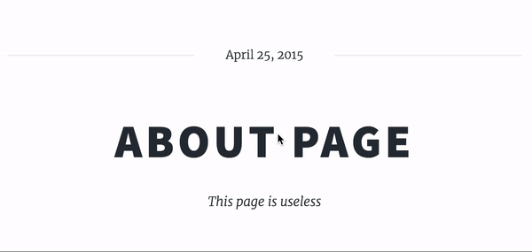

# How to create a theme

## The directory structure
> Your directory structure should look something like this:

    example_theme/
    ├── db.json ----------------------------- # not really needed
        ├── static/ ------------------------- # static files goes here
        │   ├── css/
        │   │   ├── font-awesome.min.css
        │   │   ├── main.css
        │   │   ├── noscript.css
        │   │   ├── style.css
        │   │   ├── style.css.map
        │   │   └── style.scss
        │   ├── image/
        │   │   ├── bg.jpg
        │   │   ├── overlay.png
        │   │   ├── pic01.jpg
        │   │   └── pic09.jpg
        │   └── js/
        │       ├── main.js
        │       ├── skel.min.js
        │       └── util.js
        └── templates/ ---------------------- # the system will look for templates here
            ├── generic.html
            ├── index.html
            └── layout.html

> Please checkout the [example theme](example_theme) for more information  
> about the structure.

## Writing templates
> Templates are written using Jinja2 and html.
> please look at the [Jinja2 documentation](http://jinja.pocoo.org/docs/2.10/templates/)  
> for more information.

### Making your website editable
> In your layout, insert the admin navigation right after yout `<body>` tag:

    <body>
        {{ admin_navigation(page.id) }}

        ...

> All set!

### editable areas in templates
> We are using the medium editor for editable areas, to make an area editable
> while singed in, we do this:

    <!-- my-startpage.html -->

    
    <h1 class='editable' id='important-text'>about page</h1>

* Add the class `editable` to your element
* Add an `id`.
* Add a default value.

> The data will be stored along with it's ID, the value of the element
> and the page ID.

> All ids per page needs to be unique.

> This element is now editable:  

## Accessing static files
> Accessing static files is easy, here is an example:

    <!-- my-template.html -->
    
    
    

## db.json
> This is where theme-specific data is stored, can be accessed in themplates
> by using the global `db` variable, like this:
    
    <!-- my-template.html -->
    

    

        {{ db['my-cool-text'] }}
    

> It is recommended to store all default values in db.json when creating it.
