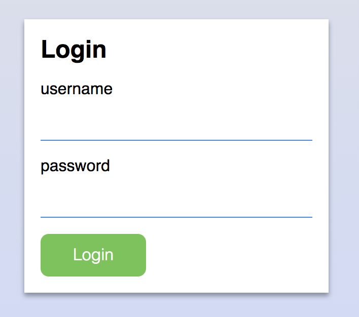

# nilms
> A content management system with built-in on-sight page editing
> that does as little as possible.

## Installation
> First, let us create a config file:

    cp config.example.json config.json

> Edit it using your favourite editor.

### Create a virtualenv

    virtualenv -p /usr/bin/python2.7 ./venv
    
    # source it
    source ./venv/bin/activate

### Install nilms
> Run the setup:

    python setup.py develop

### Start the application

    python web.py

> Now visit [http://localhost:5000/admin](http://localhost:5000/admin)  
  
> The login credentials is in your `config.json`
